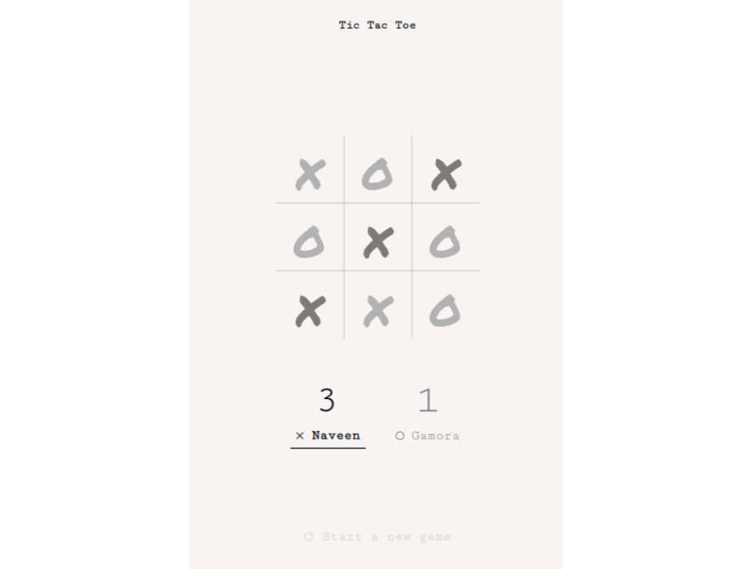

<h1 align="center">Tricky toe 🎮</h1>

## Table of Contents

- [Table of Contents](#table-of-contents)
- [Overview](#overview)
  - [Built With](#built-with)
- [Features](#features)
- [Resources](#resources)
- [Acknowledgements](#acknowledgements)
- [Author](#author)

## Overview
Tic-Tac-Toe is a long beloved classic pen and paper or board game for two players. Variations of Tic Tac Toe have been played since the Roman Empire and 3 in a row games can be traced all the way back to ancient Egypt! 

Tic Tac Toe is known by a few other names around the world. The most common of these is "Noughts and Crosses" and it is sometimes simply referred to as the "XO game."

[Checkout the demo](https://trickytoe-smakager.netlify.app/)

### Built With

<!-- This section should list any major frameworks that you built your project using. Here are a few examples.-->

- [HTML](https://developer.mozilla.org/en-US/docs/Web/HTML)
- [CSS](https://developer.mozilla.org/en-US/docs/Web/CSS)
- [JavaScript](https://developer.mozilla.org/en-US/docs/Web/JavaScript)

## Features

- [x] 👣 **Multiscreen** - multiscreen page: start page, game board, congrats page, etc
- [x] ⛩️  **Design** - Minimalist stunning design
- [ ] 🤖 **AI** - an unbeatable AI using the minimax algorithm
- [ ] 🍕  **MMO** - you can play with your friend online via a link
- [x] 🗽  **Names** - the interface allow players to put in their names
 
## Resources
- [IconScout](https://iconscout.com/) - for icons
- [Google fonts](https://fonts.google.com/) - for fonts

## Acknowledgements

<!-- This section should list any articles or add-ons/plugins that helps you to complete the project. This is optional but it will help you in the future. For exmpale -->

- [Try tucking everything away inside of a module or factory](https://www.theodinproject.com/lessons/node-path-javascript-factory-functions-and-the-module-pattern)
- **Game logic** - check for 3-in-a-row and a tie.
- **Refactoring code** - using factory functions and modular functions
  
## Author

Hampshire is developed by [@Naveen](https://github.com/claymeers)